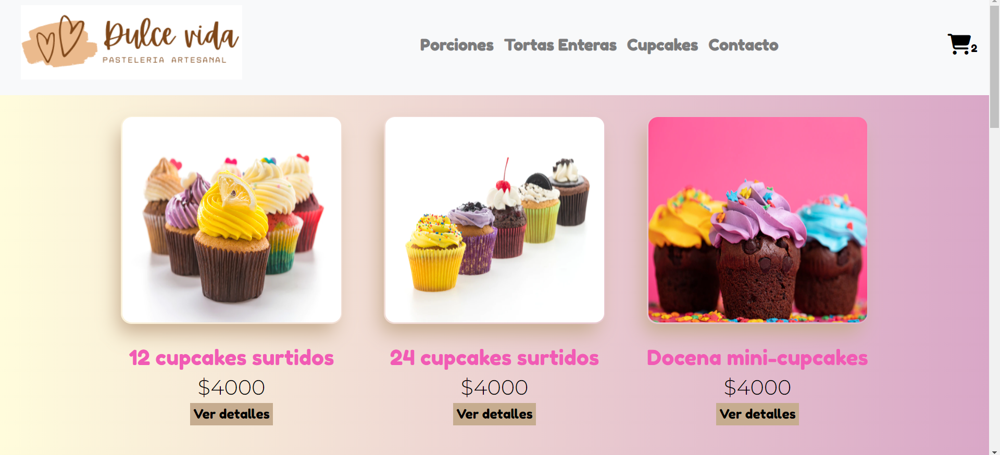
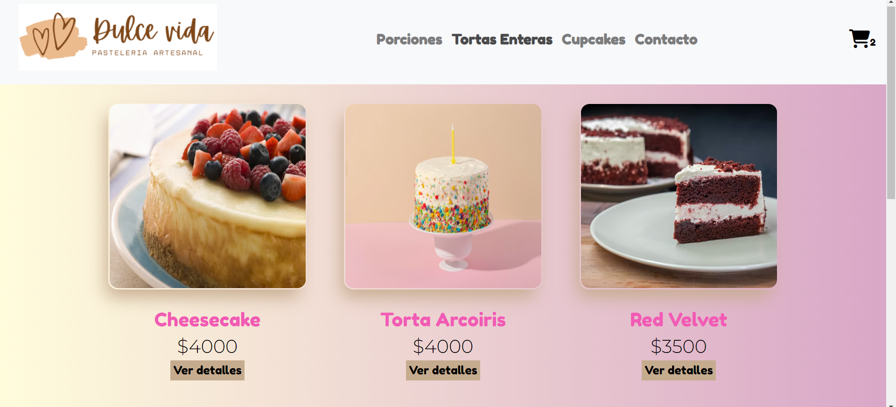
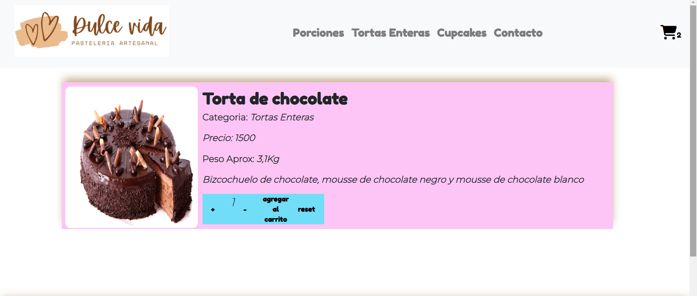
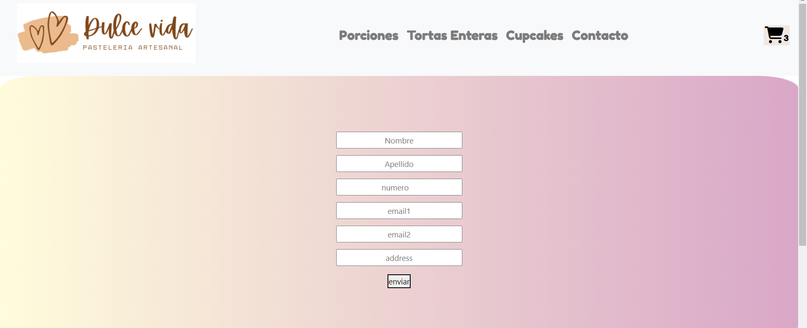

# E-commerce comision 45060-React
## contenido
```javascript
const alummno = 'Gianne Lopez'
```
+ posee 2 ramas, pero todo el contenido del proyecto se encuentra en Main
+ incompleta para la comercializacion

Este proyecto fue realizado para el Curso de React en CoderHouse. Dicho proyecto se trata de un E-commerce basado en venta de productos de pasteleria(cupcakes, tortas, porciones).

 Se puede navegar por las distintas categorias e ir a sus detalles.
 En el detalle se puede ver la categoria a la que corresponde el producto, imagen, precio, y peso aproximado del mismo; y permite agregarlos al carrito.

  Además, se pueden ver y eliminar los elementos del carrito o vaciar el carrito en su totalidad. una vez elegido los productos, finaliza la compra a través del llenado de un formulario de compra. Finalmente se guarda la orden de compra (con todos sus productos, sus detalles y la fecha de compra) en una base de datos del proyecto, alojada en Firebase y se le proporciona un ID de compra al usuario tambien generada a traves de Firebase.


## Tecnologia:
 + [Create React App](https://create-react-app.dev/docs/getting-started). La App fue creada con Create React App

Utiliza una serie de librerías externas 

+ [React-Router-Dom](https://reactrouter.com/en/main).     nos permite el enrutamiento y navegabilidad entre los diferentes componentes de nuestra SPA.
```
npm install react-router-dom
```
+ [Firebase](https://reactrouter.com/en/main).  plataforma digital diseñada para facilitar el desarrollo de aplicaciones web y móviles, con el objetivo de mejorar el rendimiento de las mismas a través de la implementación de sus distintos módulos que harán que la aplicación sea mucho más manejable, segura y fácil de utilizar para los usuarios.

+ [Bootstrap](https://react-bootstrap.github.io/getting-started/introduction/).  Framework front-end con el que le damos los diferentes estilos. 
```
npm install react-bootstrap bootstrap
```
 + Bootstrap 4.1.0 : 
 Kit de herramientas de código abierto de front-end, usado para darle estilos al proyecto. El mismo está inyectado a través de un link agregado en el head del index.html
```
<link rel="stylesheet" href="https://stackpath.bootstrapcdn.com/bootstrap/4.1.0/css/bootstrap.min.css" 
integrity="sha384-9gVQ4dYFwwWSjIDZnLEWnxCjeSWFphJiwGPXr1jddIhOegiu1FwO5qRGvFXOdJZ4" 
crossorigin="anonymous">
```
+ [Google Icons](https://fonts.google.com/icons) Biblioteca de íconos de código abierto de Google. El link es inyectado al proyecto en el index.html
```
<link rel="stylesheet" href="https://fonts.googleapis.com/css2?family=Material+Symbols+Outlined:opsz,wght,FILL,GRAD@48,400,0,0" />
```
 + [Font Awesome](https://fonts.google.com/icons) Biblioteca de íconos de código abierto. El link es inyectado al proyecto en el index.html
```
<script src="https://kit.fontawesome.com/68f6372bfa.js" crossorigin="anonymous"></script>

```
 + [React-spinners](https://www.npmjs.com/package/react-spinners)
 libreria de React que proporciona un componente giratorio React SVG simple que se puede implementar para la operación de espera asíncrona antes de que los datos se carguen en la vista.
```
npm install --save react-spinners

```
 + [SweetAlert2](https://sweetalert2.github.io/#download):  es una librería que te permite crear ventanas emergentes con un diseño profesional y fácil de personalizar e implementar
```
npm install sweetalert2

```

### pasos para levantar el proyecto

### 1. Clonar el repositorio
```
https://github.com/paolalopez1996/coder-app-react.git
```
### 2. instalar las dependencias
```
npm install
```
### 3. correr el proyecto en el navegador
```
npm start
```
## Vista del proyecto
### Home


### Categorias


### Categorias


### Categorias
